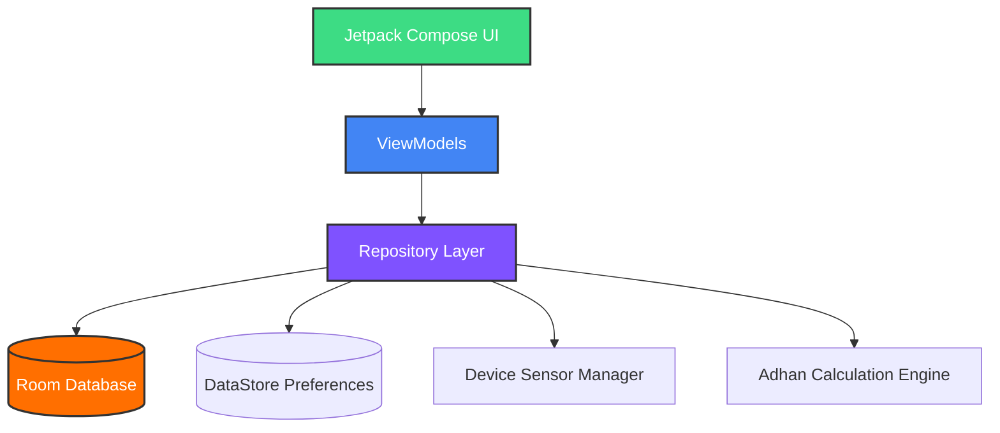

# <p align="center"><br>Sajdah - Islamic Assistant</p>

<p align="center">
  
  
  
  
</p>

---

### 🌟 About Sajdah
**Sajdah** is a premium, modern Islamic companion application for Android designed to help you stay connected with your daily prayers and duties. Built from the ground up using **Kotlin**, **Jetpack Compose (Material 3)**, and modern Android architecture guidelines, Sajdah offers a fluid, responsive, and visually stunning experience in both light and dark modes.

> *Elevate your daily worship with Sajdah. Seamlessly track offline prayer times, receive intelligent custom notifications, find the exact Qibla direction via a sensor-guided compass, and calculate your Zakat with precision. Experience a premium, fluid Material 3 dark/light theme.*

---

## 🎨 Key Features

<table width="100%">
  <tr>
    <td width="50%" valign="top">
      <h4>🕌 Offline Prayer Times</h4>
      <ul>
        <li>Highly accurate calculation engine using the industry-standard <b>Adhan library</b>.</li>
        <li>Works completely offline based on GPS or custom coordinates.</li>
        <li>Supports multiple calculation conventions (e.g., MWL, ISNA, Egypt, Makkah, Karachi).</li>
      </ul>
    </td>
    <td width="50%" valign="top">
      <h4>🔔 Smart Reminders</h4>
      <ul>
        <li>Offline-first custom scheduling using <b>AlarmManager</b> and <b>WorkManager</b>.</li>
        <li>Timely push notification alerts for every prayer.</li>
        <li>Respects system battery optimizations and schedules reliably.</li>
      </ul>
    </td>
  </tr>
  <tr>
    <td width="50%" valign="top">
      <h4>🧭 Real-time Qibla Compass</h4>
      <ul>
        <li>Visual compass indicating direction to the Kaaba.</li>
        <li>Utilizes device sensors (accelerometer & magnetometer) for real-time tracking.</li>
        <li>Smooth rotations and haptic guidance.</li>
      </ul>
    </td>
    <td width="50%" valign="top">
      <h4>💰 Zakat Calculator</h4>
      <ul>
        <li>Effortless calculations across multiple asset categories (gold, silver, cash, investments).</li>
        <li>Tracks Nisab thresholds automatically.</li>
        <li>Simple, intuitive step-by-step breakdown.</li>
      </ul>
    </td>
  </tr>
</table>

---

## 🛠️ Architecture & Tech Stack

Sajdah is built following modern **MVVM (Model-View-ViewModel)** architecture and Clean Architecture principles, ensuring scalability, testability, and a clean separation of concerns.



### Technical Highlights
- **UI Toolkit:** Jetpack Compose with Material 3 components and dynamic theme capabilities.
- **Dependency Injection:** Dagger Hilt for clean and robust constructor dependency injection.
- **Local Storage:** 
  - **Room Database** for caching and prayer logs.
  - **Preferences DataStore** for user settings, calculation methods, and configuration options.
- **Background Operations:** WorkManager for automatic daily rescheduling and AlarmManager for high-precision notifications.
- **Serialization:** Kotlinx Serialization for safe and fast JSON conversion.

---

## 🚀 Getting Started

Follow these steps to build and run Sajdah locally:

### Prerequisites
- **Android Studio Koala** (or newer)
- **Android SDK 34**
- **JDK 17**

### Setup Instructions
1. Clone the repository:
   ```bash
   git clone git@github.com:farzeenkhantareen/Sajdah.git
   cd Sajdah
   ```
2. Open the project in Android Studio.
3. Wait for the Gradle sync to finish.
4. Run the app on your emulator or connected device.

---

## ⚙️ Permissions Required
To provide the best possible experience, Sajdah requests the following permissions:
- `ACCESS_FINE_LOCATION` & `ACCESS_COARSE_LOCATION` — For accurate calculation of prayer times and Qibla direction.
- `POST_NOTIFICATIONS` — For scheduled prayer alerts (Android 13+).
- `SCHEDULE_EXACT_ALARM` — For high-precision offline alerts.

---

## 📝 License
This project is licensed under the MIT License - see the [LICENSE](LICENSE) file for details.
